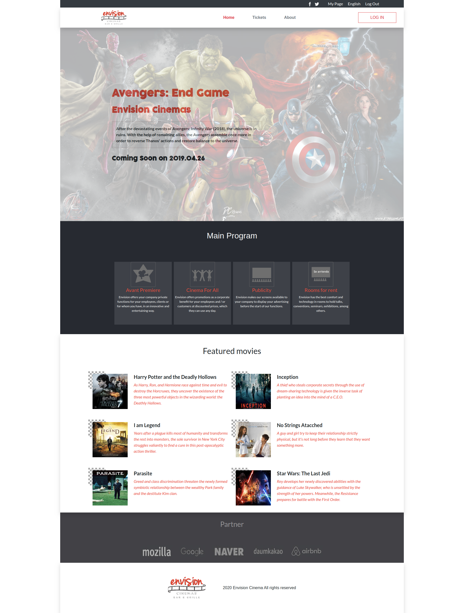
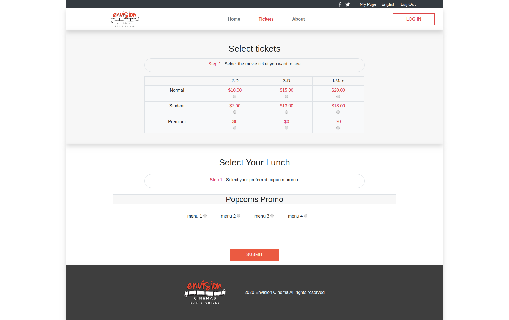
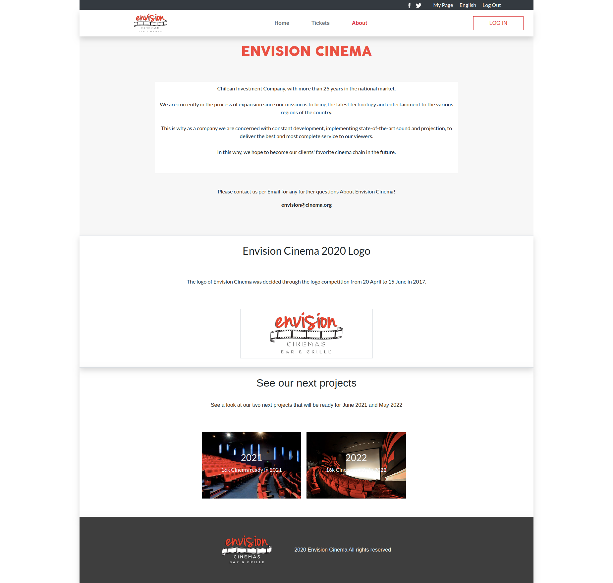

# Envision Cinema. HTML and CSS Capstone Project

> This project was built for the HTML & CSS Capstone Project is based on an online website for a cinema premier. It has three pages, the homepage, about and tickets pages.


## Screenshots











## Built With

- HTML5
- CSS
- Bootstrap
- Stylelint and stickler for linting purpose

## Requirements:

- Use bootstrap

## Live Demo

-  [Live Demo Link](https://raw.githack.com/yahir91/HTML-CSS-Capstone-Project/development/home.html)

## Getting Started

**Install on Your Own Machine.**

Setup your machine setup

### Prerequisites

  > All the prerequisites are optional

- Git
- Bootstrap

### Setup

- Follow the link below to install git.
  > [download git](https://git-scm.com/downloads)

- Follow the link below to setup HTML validator.

- Clone the repository
  > To get a local copy up and running follow these simple example steps.

1. Open the terminal comand line window
2. ``` git clone https://github.com/yahir91/HTML-CSS-Capstone-Project.git```
3. Open the home.html with your favorite browser
4. Enjoy!

### Usage

Go to the project directory and run open the `home.html` file on your browser.

## Authors

👤 **Yahir Cardona**

- Github: [@yahir91](https://github.com/yahir91)
- Twitter: [@YahirCardona3](https://twitter.com/YahirCardona3)
- Linkedin: [linkedin](https://www.linkedin.com/in/osmar-yahir-cardona-reyes-54b40b1a7/)

## 🤝 Contributing

Contributions, issues and feature requests are welcome!

Feel free to check the [issues page](https://github.com/yahir91/HTML-CSS-Capstone-Project/issues).

## Show your support

Give a ⭐️ if you like this project!

## 📝 License

This project is [MIT](LICENSE) licensed.

## Credits
📄💻 Layouts design by <a href="https://www.behance.net/adagio07" target="_blank">Cindy Shin in Behance</a>
